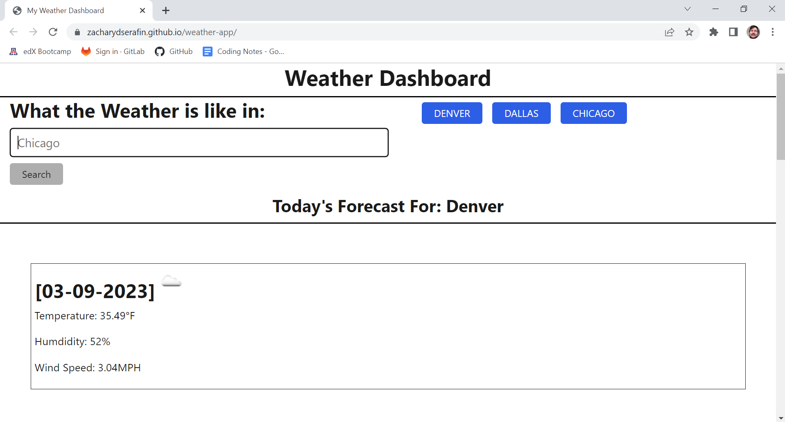

# University of Arizona Coding Boot Camp: Project Six - Weather Dashboard

*Challenge 06 - Utilizing skills we learned in "Module 6: Server Side APIs"*

## Description

The goal of Project (or Challenge) Six was to create a weather dashboard application using the openweather API. The dashboard needed to have a search function, and upon searching for a valid city, would display the current weather and the forecast for the next 5 days. The user's search history then had to be pushed to local storage, where it can be retrieved and rendered to the page in the form of buttons. These buttons, when pressed, had to pull up the weather information that corresponded with the search term.

## Screenshot

## Links

*Link to deployed webpage:* https://zacharydserafin.github.io/weather-app/

*Link to GitHub repository:* https://github.com/zacharydserafin/weather-app

## Credits

*University of Arizona Coding Bootcamp (Powered by edX)*: provided a finalized version of the code for the HTML, JavaScript, and modifications to the CSS stylesheet. I referenced this material for several key aspects of the HTML structuring and JavaScript functionality. I also used portions of the custom CSS that was used. All of these reference materials can be found here: <a href="./referencematerial">Reference Material</a>

*necolas (Nicholas Gallagher)*: As with the reference material, I also made use of the normalize.css from this user. The link to the source repository is as follows: https://github.com/necolas/normalize.css
